# Diagrama Entidad-Relación — Base de Datos SAAC

> Generado a partir de las migraciones Laravel del proyecto.
> Para visualizarlo en VS Code instala la extensión **"Markdown Preview Mermaid Support"** (`bierner.markdown-mermaid`) y abre el preview (`Ctrl+Shift+V`).

```mermaid
erDiagram

    UNIVERSIDAD {
        bigint universidad_id PK
        string nombre
        boolean activo
    }
    SEDE {
        bigint sede_id PK
        bigint universidad_id FK
        string nombre
        boolean activo
    }
    CARRERA {
        bigint carrera_id PK
        string nombre
        boolean activo
    }
    CARRERA_SEDE {
        bigint carrera_sede_id PK
        bigint carrera_id FK
        bigint sede_id FK
    }
    CICLO_ACREDITACION {
        bigint ciclo_acreditacion_id PK
        bigint carrera_sede_id FK
        string nombre
    }
    PROCESO {
        bigint proceso_id PK
        bigint ciclo_acreditacion_id FK
        string tipo_proceso
    }
    AUTOEVALUACION {
        bigint autoevaluacion_id PK
        bigint proceso_id FK
        date fecha_inicio
        date fecha_fin
    }
    COMPROMISO_MEJORA {
        bigint compromiso_mejora_id PK
        bigint proceso_id FK
        text descripcion
        date fecha_inicio
        date fecha_fin
        enum estado
        boolean activo
    }
    USUARIO {
        bigint usuario_id PK
        string cedula
        string nombre
        string email
        string status
    }
    CARRERA_USUARIO {
        bigint carrera_usuario_id PK
        bigint usuario_id FK
        bigint carrera_id FK
    }
    TIPO_ACCION {
        bigint tipo_accion_id PK
        string descripcion
    }
    BITACORA {
        bigint bitacora_id PK
        bigint tipo_accion_id FK
        bigint usuario_id FK
        string modulo
        timestamp fecha_hora
        text detalle
    }
    COMENTARIO {
        bigint comentario_id PK
        bigint usuario_id FK
        string commentable_type
        bigint commentable_id
        text texto
    }
    DIMENSION {
        bigint dimension_id PK
        string nombre
        string nomenclatura
        boolean activo
    }
    COMPONENTE {
        bigint componente_id PK
        bigint dimension_id FK
        string nombre
        string nomenclatura
        boolean activo
    }
    CRITERIO {
        bigint criterio_id PK
        bigint componente_id FK
        string descripcion
        string nomenclatura
        boolean activo
    }
    ESTANDAR {
        bigint estandar_id PK
        bigint criterio_id FK
        string descripcion
        boolean activo
    }
    ESTADO_EVIDENCIA {
        bigint estado_evidencia_id PK
        string nombre
    }
    EVIDENCIA {
        bigint evidencia_id PK
        bigint criterio_id FK
        bigint estado_evidencia_id FK
        string descripcion
        string nomenclatura
        boolean activo
    }
    ARCHIVO {
        bigint archivo_id PK
        bigint evidencia_id FK
        bigint usuario_id FK
        bigint proceso_id FK
        timestamp fecha_subida
        enum tipo
        string path
        text url
        string nombre_original
        bigint tamanio
        boolean is_publico
        string token_publico
    }
    EVIDENCIA_ASIGNACION {
        bigint evidencia_asignacion_id PK
        bigint proceso_id FK
        bigint evidencia_id FK
        bigint usuario_id FK
        string estado
        datetime fecha_asignacion
        datetime fecha_limite
    }
    SOLICITUD_AMPLIACION {
        bigint solicitud_ampliacion_id PK
        bigint evidencia_asignacion_id FK
        bigint usuario_id FK
        bigint usuario_resolutor_id FK
        string motivo
        datetime fecha_sugerida
        string estado
    }
    APROBACION_CRITERIO {
        bigint aprobacion_criterio_id PK
        bigint criterio_id FK
        bigint proceso_id FK
        bigint usuario_id FK
        enum estado
        string comentario
    }
    APROBACION_EVIDENCIA {
        bigint aprobacion_evidencia_id PK
        bigint evidencia_id FK
        bigint proceso_id FK
        bigint criterio_aprobacion_id FK
        bigint usuario_id FK
        enum estado
    }
    COMPROMISO_MEJORA_EVIDENCIA {
        bigint compromiso_mejora_id FK
        bigint evidencia_id FK
    }
    COMPROMISO_MEJORA_EVIDENCIA_ASIGNACION {
        bigint compromiso_mejora_id FK
        bigint evidencia_asignacion_id FK
        text comentario
    }

    %% ── Jerarquía institucional ──
    UNIVERSIDAD ||--o{ SEDE : "tiene"
    SEDE ||--o{ CARRERA_SEDE : "pertenece a"
    CARRERA ||--o{ CARRERA_SEDE : "ofertada en"
    CARRERA_SEDE ||--o{ CICLO_ACREDITACION : "tiene"
    CICLO_ACREDITACION ||--o{ PROCESO : "contiene"

    %% ── Proceso → subentidades ──
    PROCESO ||--o| AUTOEVALUACION : "genera"
    PROCESO ||--o{ COMPROMISO_MEJORA : "genera"
    PROCESO ||--o{ EVIDENCIA_ASIGNACION : "tiene"
    PROCESO ||--o{ ARCHIVO : "almacena"
    PROCESO ||--o{ APROBACION_CRITERIO : "registra"
    PROCESO ||--o{ APROBACION_EVIDENCIA : "registra"

    %% ── Catálogo académico ──
    DIMENSION ||--o{ COMPONENTE : "agrupa"
    COMPONENTE ||--o{ CRITERIO : "tiene"
    CRITERIO ||--o{ ESTANDAR : "define"
    CRITERIO ||--o{ EVIDENCIA : "requiere"
    CRITERIO ||--o{ APROBACION_CRITERIO : "es aprobado en"

    %% ── Evidencias ──
    ESTADO_EVIDENCIA ||--o{ EVIDENCIA : "clasifica"
    EVIDENCIA ||--o{ ARCHIVO : "documentada con"
    EVIDENCIA ||--o{ EVIDENCIA_ASIGNACION : "asignada en"
    EVIDENCIA ||--o{ COMPROMISO_MEJORA_EVIDENCIA : "vinculada a"
    EVIDENCIA ||--o{ APROBACION_EVIDENCIA : "aprobada en"

    %% ── Usuarios ──
    USUARIO ||--o{ BITACORA : "genera"
    USUARIO ||--o{ COMENTARIO : "escribe"
    USUARIO ||--o{ ARCHIVO : "sube"
    USUARIO ||--o{ CARRERA_USUARIO : "asignado a"
    USUARIO ||--o{ EVIDENCIA_ASIGNACION : "responsable de"
    USUARIO ||--o{ SOLICITUD_AMPLIACION : "solicita"
    USUARIO ||--o{ APROBACION_CRITERIO : "aprueba"
    USUARIO ||--o{ APROBACION_EVIDENCIA : "aprueba"
    CARRERA ||--o{ CARRERA_USUARIO : "tiene"

    %% ── Auditoría ──
    TIPO_ACCION ||--o{ BITACORA : "categoriza"

    %% ── Compromisos de mejora ──
    COMPROMISO_MEJORA ||--o{ COMPROMISO_MEJORA_EVIDENCIA : "incluye"
    COMPROMISO_MEJORA ||--o{ COMPROMISO_MEJORA_EVIDENCIA_ASIGNACION : "vincula"
    EVIDENCIA_ASIGNACION ||--o{ COMPROMISO_MEJORA_EVIDENCIA_ASIGNACION : "vinculada a"
    EVIDENCIA_ASIGNACION ||--o{ SOLICITUD_AMPLIACION : "tiene"

    %% ── Aprobaciones ──
    APROBACION_CRITERIO ||--o{ APROBACION_EVIDENCIA : "contiene"
```

---

## Tablas de sistema (no incluidas en el diagrama)

| Tabla | Descripción |
|-------|-------------|
| `cache` | Caché de Laravel |
| `jobs` / `job_batches` / `failed_jobs` | Colas de trabajo |
| `sessions` | Sesiones de usuario |
| `personal_access_tokens` | Tokens Sanctum |
| `permissions` / `roles` / `model_has_roles` / `model_has_permissions` / `role_has_permissions` | Paquete Spatie Permissions |
| `notifications` | Notificaciones Laravel |
